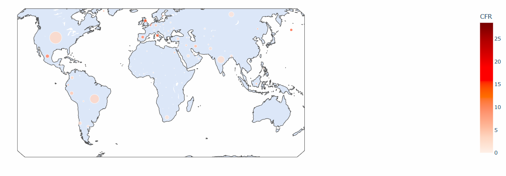
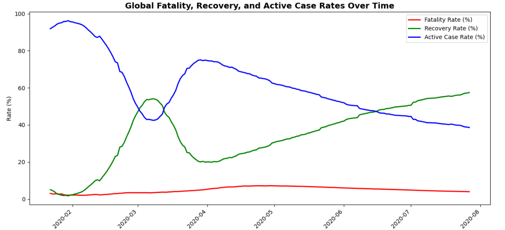

## 🦠 Global COVID-19 EDA Project
📌 Project Overview

This exploratory data analysis investigates the early months of the COVID-19 pandemic (January–July 2020), using SQL-style logic alongside Python (Pandas, Seaborn, Plotly) for visualization.
Highlights include global trends, country-wide case comparisons, fatality and recovery rates, WHO regional insights, and interactive maps and dashboards.

### 📊 Screenshots  

  
*Figure 1: Global Case Fatality Rate (CFR)*  

  
*Figure 2: Global Fatality, Recovery, and Active Rates Trend*  

## 📂 Dataset

The analysis is based on the COVID-19 Dataset by imdevskp on Kaggle, which provides daily updates on confirmed cases, deaths, recoveries, and active counts.

🔗 Source: Kaggle — corona-virus-report dataset

## ✨ Key Features

Global Trends: Cumulative cases and deaths visualized over time.

Top Country Comparison: Bar charts and dashboards showing confirmed cases, total deaths, fatality rates (CFR), and recovery rates.

Rate Trends: Time-series line plots comparing fatality, recovery, and active case percentages.

WHO Regional Analysis: Comparison of regional outcomes across WHO-defined zones.

Geographic Visualizations: Interactive bubble maps — bubble size represents confirmed cases, color represents CFR.

Methodology: Original SQL queries are included as comments/Markdown for clarity, with Pandas implementations for runtime compatibility.

## ⚙️ How to Run

Clone this repository.

Open the Jupyter Notebook in your environment (local, Google Colab, or Kaggle).

Run all notebook cells sequentially — visualizations and insights will render automatically.

## 📊 Insights

Global deaths escalated rapidly during March–April 2020, stabilizing mid-year.

US, Brazil, and India reported the highest absolute impact.

Fatality Rate (CFR) stabilized around 3–5%, while recovery rates steadily climbed past 50% by June.

Europe experienced the highest regional fatality, while Asia demonstrated stronger recovery trends.

## 📝 Notes & Acknowledgments

Dataset spans only the early phase of the pandemic (up to July 27, 2020) → later waves (Delta, Omicron) and vaccination effects are not included.

Some countries (e.g., the UK) did not consistently report recovery data, affecting comparative metrics.

The project showcases both SQL logic and Python-based execution to ensure clarity and reproducibility.
